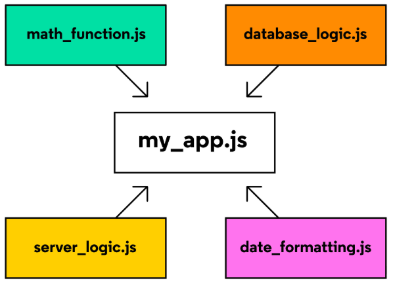

# Modules

Mdules are reusable pieces of code in a file that can be exported and then imported for use in another file.

A modular program is one whose components can be separated, used individually, and recombined to create a complex system.



In the example above, instead of having the entire program written within my_app.js, its components are broken up into separate modules that each handle a particular task:
- database_logic.js module contain code for storing and retrieving data from a database
- date_formatting.js module contains functions designed to easily convert date values from one format to another.

This modular strategy is sometimes called separation of concerns and is useful to:
- find, fix, and debug code more easily
- reuse and recycle defined logic in different parts of your application
- keep information private and protected from other modules
- prevent pollution of the global namespace and potential naming collisions, by cautiously selecting variables and behavior we load into a program

There are multiple ways of implementing modules depending on the runtime environment in which your code is executed:
- The Node runtime environment supports CommonJS modules by default.
- The browser’s runtime environment uses ES6 modules.

## Implementing CommonJS Modules
Every JavaScript file that runs in a Node environment is treated as a distinct module. The functions and data defined in each module can be used by any other module as long as those resources are properly exported and imported.

### module.exports
To create a module, create a new file where the variables and functions can be declared, and to make them available to other files, add them as properties to the built-in module.exports object:
```
/* converters.js */
function celsiusToFahrenheit(celsius) {
  return celsius * (9/5) + 32;
}

module.exports.celsiusToFahrenheit = celsiusToFahrenheit;

module.exports.fahrenheitToCelsius = function(fahrenheit) {
  return (fahrenheit - 32) * (5/9);
};
```
In the first approach, the already-defined function celsiusToFahrenheit is assigned to module.exports.celsiusToFahrenheit
In the second, a new function expression is declared and assigned to module.exports.fahrenheitToCelsius.
Other files can now import this object and use these two functions.

### require()
The require() function accepts a string as an argument that provides the file path to the module you would like to import.
```
/* water-limits.js */
const converters = require('./converters.js');

const freezingPointC = 0;
const boilingPointC = 100;

const freezingPointF = converters.celsiusToFahrenheit(freezingPointC);
const boilingPointF = converters.celsiusToFahrenheit(boilingPointC);

console.log(`The freezing point of water in Fahrenheit is ${freezingPointF}`);
console.log(`The boiling point of water in Fahrenheit is ${boilingPointF}`);
```
When you use require(), the entire module.exports object is returned and stored in the variable converters. This means that both the .celsiusToFahrenheit() and .fahrenheitToCelsius() methods can be used in this program.

### References
[Node runtime environment](https://nodejs.org/en/about/)

## Implementing ES6 Modules in the Browser
A module must be entirely contained within a file. You need to consider where a new module may be placed within the file system. For example, if the module needs to be used by two projects, it needs to be put it in a mutually accessible location, like this:
```
secret-image/
|-- secret-image.html
|-- secret-image.js
secret-messages/
|-- secret-messages.html
|-- secret-messages.js
modules/
|-- dom-functions.js    <-- new module file
```

### ES6 Named Export Syntax
Using ES6 syntax, the name of each exported resource is listed between curly braces and separated by commas. In the example below, the two functions are exported using the ES6 export statement:
```
/* dom-functions.js */
const toggleHiddenElement = (domElement) => {
  if (domElement.style.display === 'none') {
    domElement.style.display = 'block';
  } else {
    domElement.style.display = 'none';
  }
}

const changeToFunkyColor = (domElement) => {
  const r = Math.random() * 255;
  const g = Math.random() * 255;
  const b = Math.random() * 255;
        
  domElement.style.background = `rgb(${r}, ${g}, ${b})`;
}

export { toggleHiddenElement, changeToFunkyColor };
```
In addition to the syntax above, individual values may be exported as named exports by simply placing the export keyword in front of the variable’s declaration:
```
/* dom-functions.js */
export const toggleHiddenElement = (domElement) => {
  // logic omitted...
}

export const changeToFunkyColor = (domElement) => {
  // logic omitted...
}
```

### ES6 Named Import Syntax
Now that the secret-messages functions were exported, secret-messages program can imports functionality from dom-functions.js. Notice the ES6 syntax for importing named resources from modules is similar to the export syntax:
```
/* secret-messages.js */
import { toggleHiddenElement, changeToFunkyColor } from '../modules/dom-functions.js';

const buttonElement = document.getElementById('secret-button');
const pElement = document.getElementById('secret-p');

buttonElement.addEventListener('click', () => {
  toggleHiddenElement(pElement);
  changeToFunkyColor(buttonElement);
});
```
secret-messages.html should also be updated adding the attribute type='module' to the 'script' element to avoid some browsers to throw an error.
```
<!-- secret-messages.html --> 
<html>
  <head>
    <title>Secret Messages</title>
  </head>
  <body>
    <button id="secret-button"> Press me... if you dare </button>
    <p id="secret-p" style="display: none"> Modules are fancy! </p>
    <script type="module" src="./secret-messages.js"> </script>
  </body>
</html>
```

### Renaming Imports to Avoid Naming Collisions
Sometimes, resources you wish to import share a name with some other value that already exists in your program (or from another imported module).
```
/* inside greeterEspanol.js */
const greet = () => {
  console.log('hola');
}
export { greet };

/* inside greeterFrancais.js */
const greet = () => {
  console.log('bonjour');
}
export { greet };
```

We can use alias (as) to avoid an error due to the fact that the imported identifier(s) have already been defined.
```
/* main.js */
import { greet as greetEspanol } from 'greeterEspanol.js';
import { greet as greetFrancais } from 'greeterFrancais.js';

greetEspanol();             // Prints: hola
greetFrancais();            // Prints: bonjour
```
### Default Exports and Imports
We can import/export an object containing the entire set of functions and/or data values of a module by using Default Exports and Imports.

From previous example, the dom-functions.js module could be rewritten to use a default export:
```
/* dom-functions.js */
const toggleHiddenElement = (domElement) => {
    if (domElement.style.display === 'none') {
      domElement.style.display = 'block';
    } else {
      domElement.style.display = 'none';
    }
}

const changeToFunkyColor = (domElement) => {
  const r = Math.random() * 255;
  const g = Math.random() * 255;
  const b = Math.random() * 255;
        
  domElement.style.background = `rgb(${r}, ${g}, ${b})`;
}

const resources = { 
  toggleHiddenElement, 
  changeToFunkyColor
};
export default resources;
```
This default export object can now be used within secret-messages.js like so:
```
import domFunctions from '../modules/dom-functions.js';

const { toggleHiddenElement, changeToFunkyColor } = domFunctions;

const buttonElement = document.getElementById('secret-button');
const pElement = document.getElementById('secret-p');

buttonElement.addEventListener('click', () => {
  toggleHiddenElement(pElement);
  changeToFunkyColor(buttonElement);
});
```

#### References
[ES6 Modules](https://developer.mozilla.org/en-US/docs/Web/JavaScript/Guide/Modules)
[ECMAScript 6 (ES6)](https://en.wikipedia.org/wiki/ECMAScript_version_history#ES6)
[DOM API](https://developer.mozilla.org/en-US/docs/Web/API/Document)